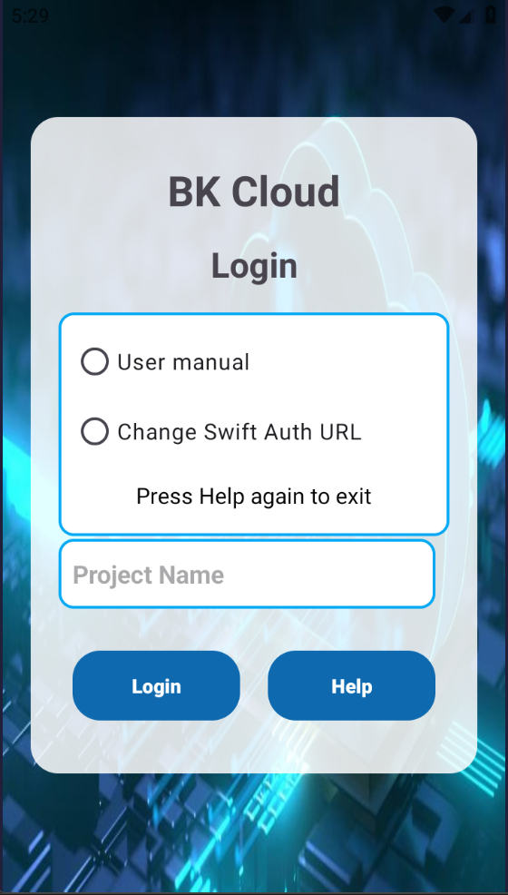
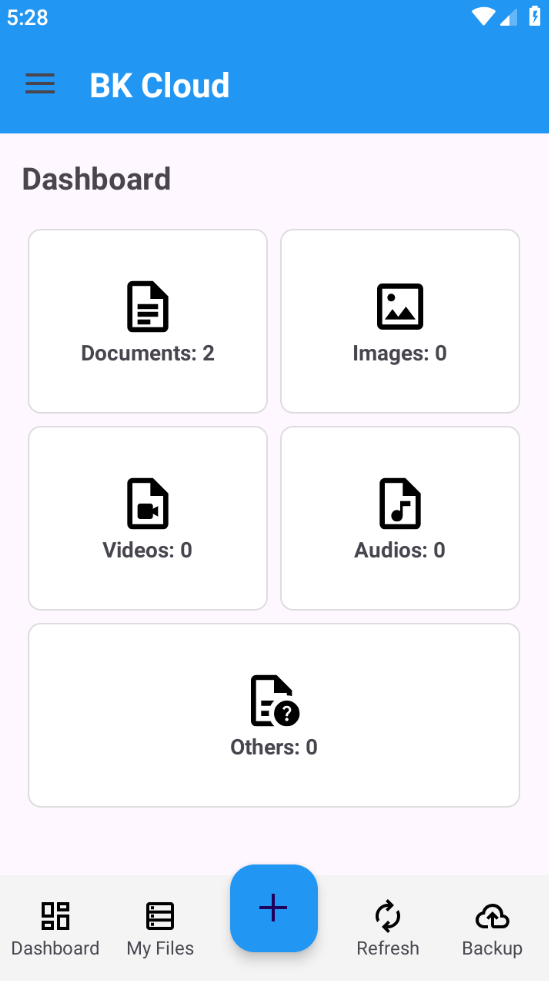
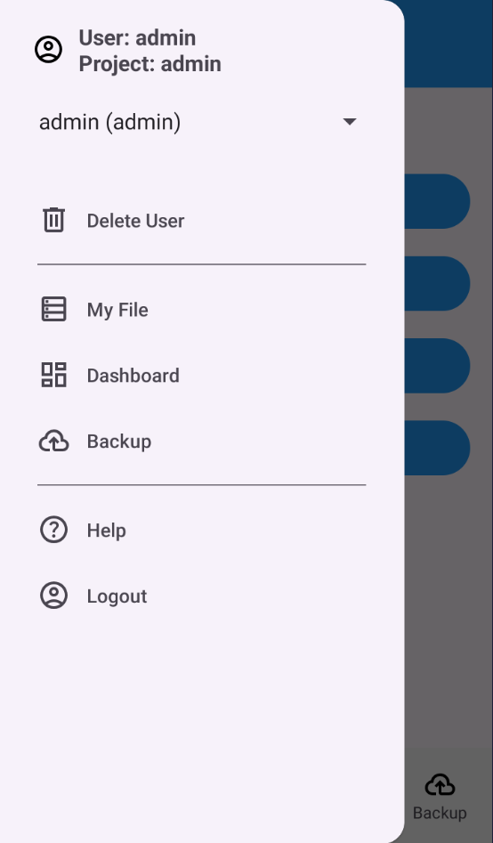

# BK Cloud App – User Manual

Tài liệu hướng dẫn sử dụng **BK Cloud App**, mô tả các chức năng chính và cách thao tác trong ứng dụng.

## 1. Đăng nhập vào ứng dụng

<p align="center">
  
</p>

- Người dùng cần nhập **Username**, **Password** và **Project name** để đăng nhập.
- Nếu thiếu thông tin, hệ thống sẽ hiển thị thông báo lỗi.

<p align="center">
  
</p>

- Người dùng cần thay đổi **Cloud Address** đúng với địa chỉ đã được thiết lập trong mục **Change Swift Auth URL**.

## 2. Tab My Files

<p align="center">
  
</p>

Tại tab này, người dùng có thể:
- **Upload**, **Download**, **Delete** files/folders.

### Hướng dẫn thao tác
- **Upload Files/Folders**:  
  Nhấn vào dấu **“+” màu xanh** ở phía dưới màn hình.
- **Download / Delete Files/Folders**:  
  - Nhấn giữ file hoặc folder khoảng **1 giây** để vào chế độ chọn.
  - Tích chọn checkbox bên trái các file/folder cần thao tác.
  - Nhấn icon chức năng bên phải để thực hiện.
  - Nhấn giữ file lần nữa để thoát chế độ chọn.

## 3. Tab Dashboard

<p align="center">
  
</p>

- Hiển thị **tổng số lượng file** trên cloud.
- Phân loại file theo từng loại và hiển thị **tỷ lệ (%)** tương ứng.

## 4. Tab Backup

<p align="center">
  
</p>

Tab này dùng để cấu hình và thực hiện backup dữ liệu.

### Chức năng chính
- **Set backup time**  
  - Cài đặt ngày và giờ backup.
  - Hệ thống sẽ gửi thông báo cho người dùng tại 3 thời điểm:
    - 30 phút trước khi backup
    - 10 phút trước khi backup
    - Khi bắt đầu backup
- **Backup now**  
  - Backup ngay các phân vùng đã chọn lên cloud.
  - Cấu trúc thư mục backup:
    ```
    /Backup/dd.MM.yyyy.HH.mm/<phân_vùng_backup>
    ```
- **Clear backup setting**  
  - Xóa toàn bộ cấu hình backup đã cài đặt.

## 5. Navigation Menu

<p align="center">
  
</p>

- Hiển thị thông tin **User** và **Project** hiện tại.
- **Switch User (Dropdown)**:
  - Chuyển sang user đã từng đăng nhập trước đó.
  - Nhập mật khẩu của user để xác nhận.
- **Delete User**:
  - Xóa user đã lưu trong danh sách switch user.
- **My Files / Dashboard / Backup**:
  - Điều hướng giữa các màn hình chính.
- **Logout**:
  - Đăng xuất khỏi ứng dụng.

## 6. Help Menu

<p align="center">
  
</p>

- **User Manual**: Xem hướng dẫn sử dụng ứng dụng.
- **Change User Password**:
  - Thay đổi mật khẩu của user hiện tại.
  - Lưu ý: Không được trùng với mật khẩu gần nhất.
- **Change Cloud Storage Limit**:
  - Thay đổi dung lượng lưu trữ tối đa của cloud.

